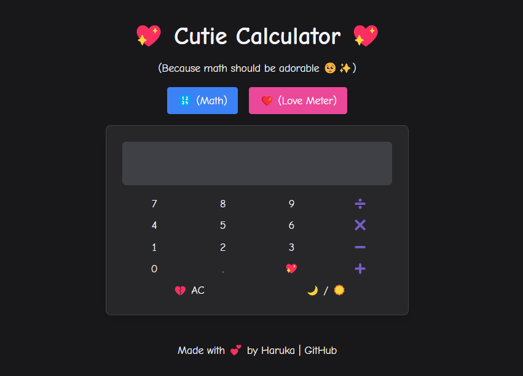

# Cherry Blossom Animation with Partner Cards 🌸

This project features a beautiful cherry blossom animation across the entire page, including over and behind the partner cards section. It is built with **HTML, CSS, and JavaScript**, ensuring a modern and visually appealing design.

## ✨ Features
- 🌸 **Cherry blossom animation** floating across the screen  
- 📦 **Partner cards** with a sleek and responsive design  
- 🎨 **Modern UI** with clean styling  
- ⚡ **Optimized performance** for smooth animations  

## 🚀 Installation & Usage
1. Clone the repository:
   ```bash
   git clone https://github.com/kyrexiii/basic-calculator.git
   ```
2. Navigate to the project directory:
   ```bash
   cd basic-calculator
   ```
3. Open `index.html` in your browser.

## 📜 File Structure
```
/basic-calculator
│── index.html     # Main HTML file
│── styles.css     # CSS for styling and animations
│── script.js      # JavaScript for animations
└── assets/        # (Optional) Folder for images or other assets
```

## 🛠️ Technologies Used
- HTML5  
- CSS3  
- JavaScript  

## 📷 Preview


## 🤝 Contributing
Feel free to fork this repository and submit pull requests. Suggestions and improvements are always welcome!

## 📄 License
This project is open-source and available under the **MIT License**.

---

⭐ **Don't forget to give this project a star if you like it!** ⭐
```
